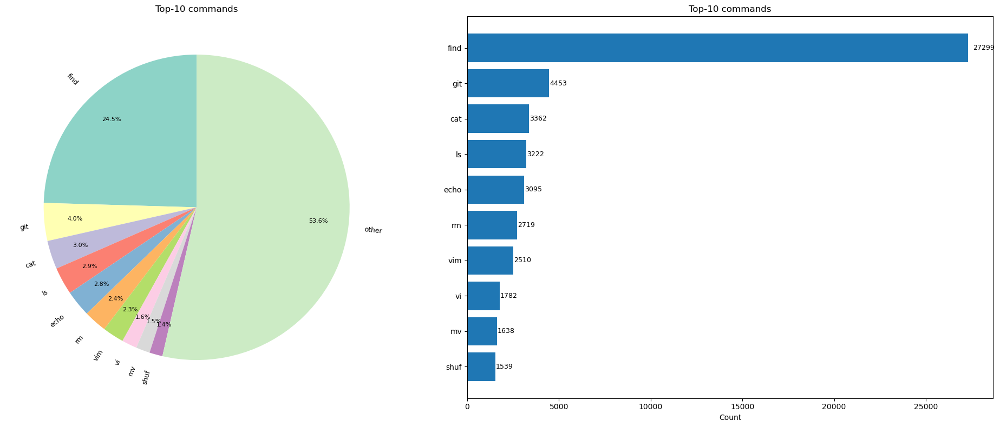
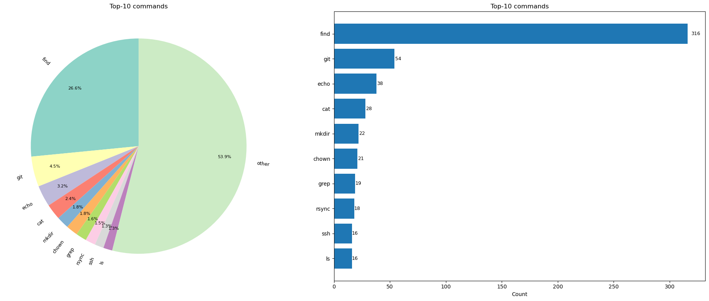

# Bash Command Generation Model

A fine-tuned T5-small model for generating bash commands from natural language descriptions, with a comprehensive data annotation pipeline and training framework.

## Overview

This project implements a machine learning system that translates natural language requests into executable bash commands. The model is based on T5-small architecture, fine-tuned on a carefully curated dataset of bash commands and their natural language descriptions.

## Model Architecture

- **Base Model**: T5-small
- **Task**: Sequence-to-sequence translation (text → bash command)
- **Framework**: PyTorch Lightning with Hugging Face Transformers
- **Training Strategy**: Fine-tuning with early stopping and best model checkpointing

## Dataset

### Data Collection and Annotation

I collected and annotated over 60k real terminal executed commands from `.bash_history` `.zsh_history` files, internet sources, and parsing man pages:

#### **LLM evaluations**

For annotation and filter task was evaluated llms and prompts on hand markuped dataset in 100 examples.

Model annotated every bash command with the `is_command` true or false label. There is metrics of this annotations

| Model                              | precision | recall | f1    | fn  | fp  |
| ---------------------------------- | --------- | ------ | ----- | --- | --- |
| qwen/qwen3-coder-30b               | 0.971     | 0.827  | 0.893 | 14  | 2   |
| microsoft/phi-4                    | 0.932     | 0.85   | 0.889 | 12  | 5   |
| qwen/qwen3-4b-2507                 | 0.922     | 0.728  | 0.814 | 22  | 5   |
| mistralai/mistral-7b-instruct-v0.3 | 0.904     | 0.815  | 0.857 | 15  | 7   |
| google/gemma-3n-e4b                | 0.876     | 0.963  | 0.918 | 3   | 11  |
| liquid/lfm2-1.2b                   | 0.824     | 0.763  | 0.792 | 19  | 13  |

qwen3-coder-30b was selected as a markup model for dataset because of it's perfomans and annotations abilites.

Final markup has 45119 (70%) of valid command.

### **Additional Data Sources**

- Public datasets
  - <https://github.com/magnumresearchgroup/bash_gen>
  - darkknight25/Linux_Terminal_Commands_Dataset
  - aelhalili/bash-commands-dataset
  - <https://github.com/TellinaTool/nl2bash>
- Parsing linux man pages

As a test datasets i use sample of nl2bash expert markuped dataset and ballanced with additional hand markuped data for train/test examples balancing.

### Final Dataset Composition

| Split    | Samples | Description                     |
| -------- | ------- | ------------------------------- |
| Training | 111235  | Filtered and annotated commands |
| Test     | 1190    | Manually verified commands      |

#### Train distribution



#### Test distribution



## Training Setup

### Hyperparameters

| Parameter         | Value                |
| ----------------- | -------------------- |
| Base Model        | t5-small             |
| Learning Rate     | 1e-4                 |
| Batch Size        | 16                   |
| Max Epochs        | 15                   |
| Max Source Length | 128 tokens           |
| Max Target Length | 64 tokens            |
| Early Stopping    | Based on BLEU2 score |
| Optimizer         | Adam                 |

### Performance Metrics on test set

| Metric         | Value |
| -------------- | ----- |
| Perplexity     | 1.17  |
| $BLEU^2$ Score | 0.66  |
| $BLEU^4$ Score | 0.66  |

### Evaluation comparition

I Also eval llms on test dataset on command generation task. there are results of it

| Model                              | $BLEU_2$ | $BLEU_4$ |
| ---------------------------------- | -------- | -------- |
| qwen/qwen3-coder-30b               | 0.337    | 0.195    |
| microsoft/phi-4                    | 0.293    | 0.168    |
| google/gemma-3n-e4b                | 0.277    | 0.156    |
| qwen/qwen3-4b-2507                 | 0.259    | 0.147    |
| liquid/lfm2-1.2b                   | 0.151    | 0.071    |
| mistralai/mistral-7b-instruct-v0.3 | 0.031    | 0.015    |

## Infrastructure

### ML Pipeline

- **Data Versioning**: DVC for dataset and pipeline management
- **Experiment Tracking**: MLflow for logging parameters, metrics, and artifacts
- **Annotation Pipeline**: LangChain for LLM-powered data annotation
- **Manual Annotation**: Flask web application for human verification
- **Training Framework**: PyTorch Lightning with Hugging Face Transformers

## Results and Evaluation

The final model was posted on hugging face and is available at the link:
example of inference:

```python
from transformers import pipeline

pipe = pipeline("translation", model="GeraniumCat/bash-seq-to-seq")
pipe("find all files with txt extension")
```

## Future Work

- Expand dataset with more diverse command patterns
- Incorporate syntax-aware decoding for improved command validity
- Develop a safety module to prevent generation of harmful commands
